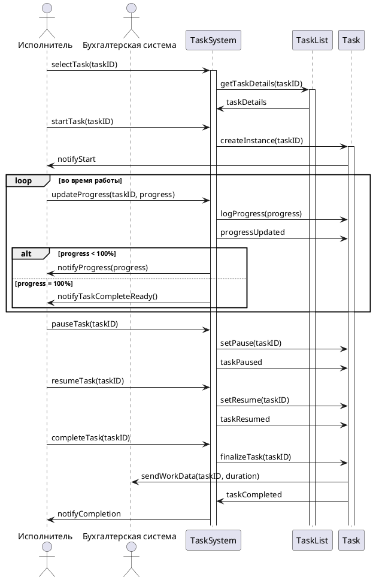

```plantuml
@startuml
actor "Исполнитель" as Worker
actor "Бухгалтерская система" as Accounting

Worker -> TaskSystem : selectTask(taskID)
activate TaskSystem
TaskSystem -> TaskList : getTaskDetails(taskID)
activate TaskList
TaskSystem <- TaskList : taskDetails

Worker -> TaskSystem : startTask(taskID)
TaskSystem -> Task : createInstance(taskID)
activate Task
Task -> Worker : notifyStart

loop во время работы
Worker -> TaskSystem : updateProgress(taskID, progress)
TaskSystem -> Task : logProgress(progress)
Task <- TaskSystem : progressUpdated
alt progress < 100%
TaskSystem -> Worker : notifyProgress(progress)
else progress = 100%
TaskSystem -> Worker : notifyTaskCompleteReady()
end
end

Worker -> TaskSystem : pauseTask(taskID)
TaskSystem -> Task : setPause(taskID)
Task <- TaskSystem : taskPaused

Worker -> TaskSystem : resumeTask(taskID)
TaskSystem -> Task : setResume(taskID)
Task <- TaskSystem : taskResumed

Worker -> TaskSystem : completeTask(taskID)
TaskSystem -> Task : finalizeTask(taskID)
Task -> Accounting : sendWorkData(taskID, duration)
TaskSystem <- Task : taskCompleted
TaskSystem -> Worker : notifyCompletion

@enduml
```