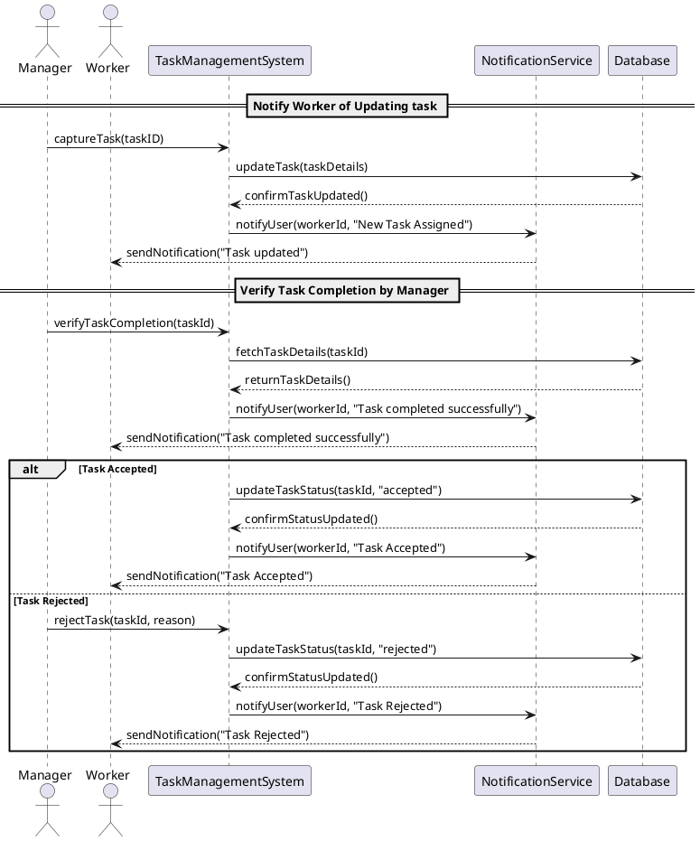

```plantuml
@startuml
actor Manager as M
actor Worker as W
participant "TaskManagementSystem" as TMS
participant "NotificationService" as NS
participant "Database" as DB

== Notify Worker of Updating task ==
M -> TMS : captureTask(taskID)
TMS -> DB : updateTask(taskDetails)
DB --> TMS : confirmTaskUpdated()
TMS -> NS : notifyUser(workerId, "New Task Assigned")
NS --> W : sendNotification("Task updated")

== Verify Task Completion by Manager ==
M -> TMS : verifyTaskCompletion(taskId)
TMS -> DB : fetchTaskDetails(taskId)
DB --> TMS : returnTaskDetails()
TMS -> NS : notifyUser(workerId, "Task completed successfully")
NS --> W : sendNotification("Task completed successfully")

alt Task Accepted
    TMS -> DB : updateTaskStatus(taskId, "accepted")
    DB --> TMS : confirmStatusUpdated()
    TMS -> NS : notifyUser(workerId, "Task Accepted")
    NS --> W : sendNotification("Task Accepted")
else Task Rejected
    M -> TMS : rejectTask(taskId, reason)
    TMS -> DB : updateTaskStatus(taskId, "rejected")
    DB --> TMS : confirmStatusUpdated()
    TMS -> NS : notifyUser(workerId, "Task Rejected")
    NS --> W : sendNotification("Task Rejected")
end
@enduml

```
