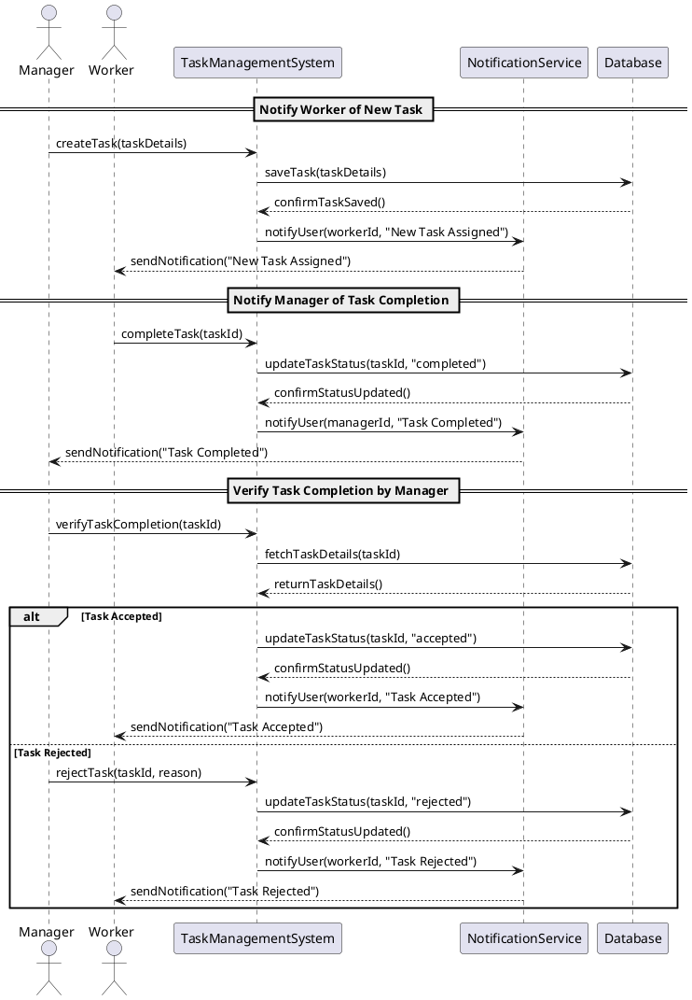

```plantuml
@startuml
actor Manager as M
actor Worker as W
participant "TaskManagementSystem" as TMS
participant "NotificationService" as NS
participant "Database" as DB

== Notify Worker of New Task ==
M -> TMS : createTask(taskDetails)
TMS -> DB : saveTask(taskDetails)
DB --> TMS : confirmTaskSaved()
TMS -> NS : notifyUser(workerId, "New Task Assigned")
NS --> W : sendNotification("New Task Assigned")

== Notify Manager of Task Completion ==
W -> TMS : completeTask(taskId)
TMS -> DB : updateTaskStatus(taskId, "completed")
DB --> TMS : confirmStatusUpdated()
TMS -> NS : notifyUser(managerId, "Task Completed")
NS --> M : sendNotification("Task Completed")

== Verify Task Completion by Manager ==
M -> TMS : verifyTaskCompletion(taskId)
TMS -> DB : fetchTaskDetails(taskId)
DB --> TMS : returnTaskDetails()
alt Task Accepted
    TMS -> DB : updateTaskStatus(taskId, "accepted")
    DB --> TMS : confirmStatusUpdated()
    TMS -> NS : notifyUser(workerId, "Task Accepted")
    NS --> W : sendNotification("Task Accepted")
else Task Rejected
    M -> TMS : rejectTask(taskId, reason)
    TMS -> DB : updateTaskStatus(taskId, "rejected")
    DB --> TMS : confirmStatusUpdated()
    TMS -> NS : notifyUser(workerId, "Task Rejected")
    NS --> W : sendNotification("Task Rejected")
end
@enduml

```
