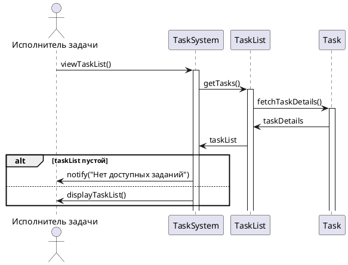

```plantuml
@startuml
actor "Исполнитель задачи" as Worker

Worker -> TaskSystem : viewTaskList()
activate TaskSystem
TaskSystem -> TaskList : getTasks()
activate TaskList
TaskList -> Task : fetchTaskDetails()
activate Task
TaskList <- Task : taskDetails
TaskSystem <- TaskList : taskList

alt taskList пустой
    TaskSystem -> Worker : notify("Нет доступных заданий")
else
    Worker <- TaskSystem : displayTaskList()
end

@enduml
```
