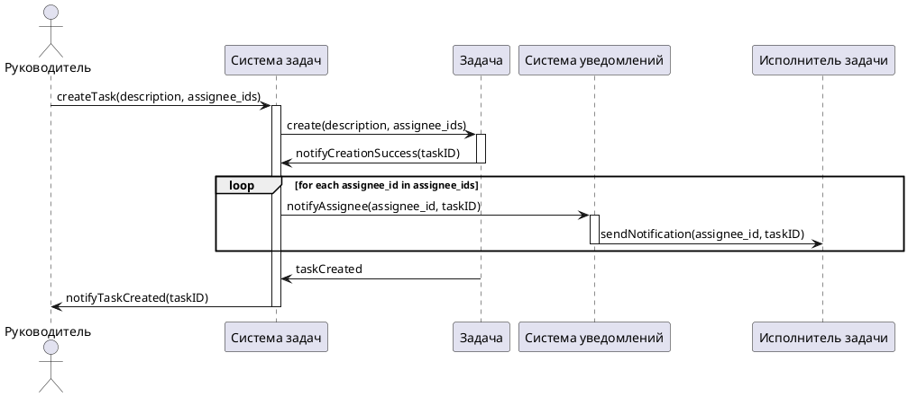

```plantuml
@startuml
actor "Руководитель" as Manager

Manager -> "Система задач" : createTask(description, assignee_ids)
activate "Система задач"
"Система задач" -> "Задача" : create(description, assignee_ids)
activate "Задача"
"Задача" -> "Система задач" : notifyCreationSuccess(taskID)
deactivate "Задача"

loop for each assignee_id in assignee_ids
    "Система задач" -> "Система уведомлений" : notifyAssignee(assignee_id, taskID)
    activate "Система уведомлений"
    "Система уведомлений" -> "Исполнитель задачи" : sendNotification(assignee_id, taskID)
    deactivate "Система уведомлений"
end

"Система задач" <- "Задача" : taskCreated
"Система задач" -> Manager : notifyTaskCreated(taskID)
deactivate "Система задач"

@enduml

```
