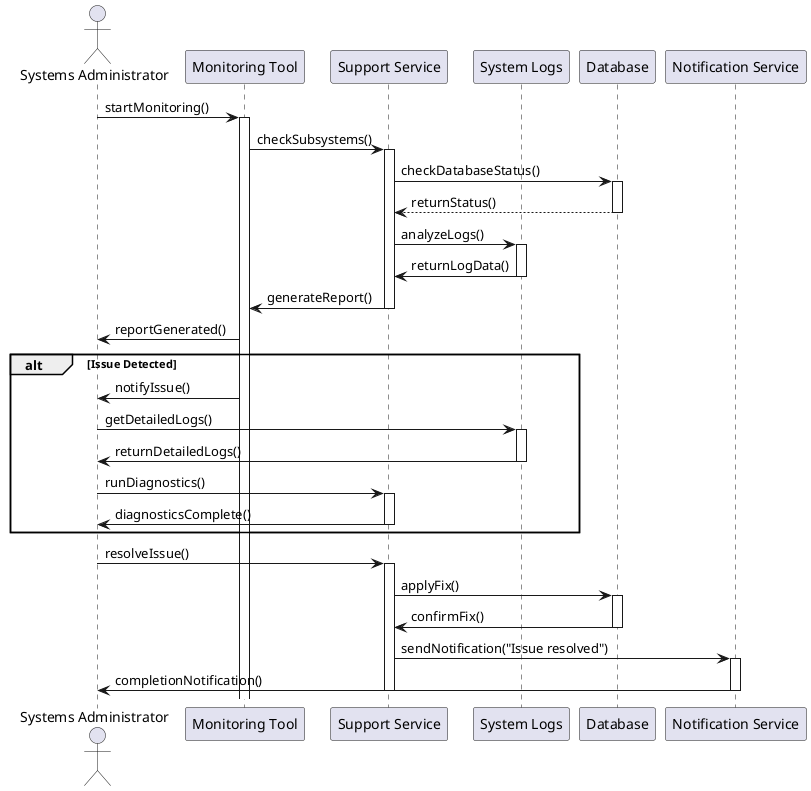

```plantuml
@startuml
actor "Systems Administrator" as SA
participant "Monitoring Tool" as MT
participant "Support Service" as SS
participant "System Logs" as Logs
participant "Database" as DB
participant "Notification Service" as NS

SA -> MT : startMonitoring()
activate MT
MT -> SS : checkSubsystems()
activate SS
SS -> DB : checkDatabaseStatus()
activate DB
DB --> SS : returnStatus()
deactivate DB
SS -> Logs : analyzeLogs()
activate Logs
SS <- Logs : returnLogData()
deactivate Logs
MT <- SS : generateReport()
deactivate SS
SA <- MT : reportGenerated()

alt Issue Detected
MT -> SA : notifyIssue()
SA -> Logs : getDetailedLogs()
activate Logs
SA <- Logs : returnDetailedLogs()
deactivate Logs
SA -> SS : runDiagnostics()
activate SS
SA <- SS : diagnosticsComplete()
deactivate SS
end

SA -> SS : resolveIssue()
activate SS
SS -> DB : applyFix()
activate DB
SS <- DB : confirmFix()
deactivate DB
SS -> NS : sendNotification("Issue resolved")
activate NS
SA <- NS : completionNotification()
deactivate NS
deactivate SS
@enduml

```
