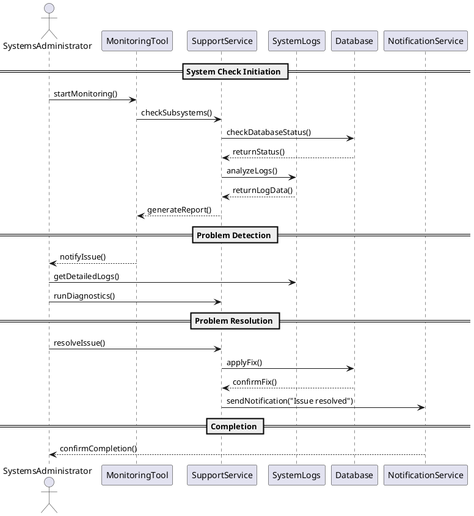

# Описание диаграммы последовательности: "Technical Support"
Диаграмма описывает процесс технической поддержки, выполняемый системным администратором. Основные этапы:

1. Инициация мониторинга

*Администратор запускает мониторинг через инструмент (MonitoringTool), который проверяет подсистемы, базу данных и анализирует логи.
* Сформированный отчёт возвращается администратору.
2. Обнаружение проблемы

* При выявлении сбоя администратор получает уведомление.
* Для диагностики администратор запрашивает детальные логи и запускает анализ через сервис поддержки.
3. Устранение проблемы

* Администратор инициирует исправление проблемы.
* Изменения применяются к базе данных или другим подсистемам, после чего отправляется подтверждение о выполнении.
4. Завершение работы

Служба уведомлений информирует администратора о завершении всех операций.
##Участвующие компоненты:
* Systems Administrator — выполняет диагностику и исправления.
* MonitoringTool — проверяет состояние системы.
* SupportService — выполняет диагностику и вносит исправления.
* Database и SystemLogs — хранят данные для анализа.
* NotificationService — отправляет уведомления о статусе операций.
