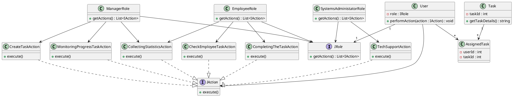

```plantuml
@startuml
' Интерфейс для проверки доступных действий для роли
interface IRole {
    +getActions() : List<IAction>
}
' Конкретные роли
class ManagerRole {
    +getActions() : List<IAction> 
}
class EmployeeRole {
    +getActions() : List<IAction>
}
class SystemsAdministatorRole{
  +getActions() : List<IAction> 
}
' Конкретные роли реализуют интерфейс Role
ManagerRole  --> IRole
EmployeeRole  --> IRole
SystemsAdministatorRole  --> IRole


' Определение интерфейса для общих действий
interface IAction {
    +execute()
}

' Конкретные действия
' Создание задания
class CreateTaskAction {
    +execute()
}
' Сбор статистики
class CollectingStatisticsAction {
    +execute()
}
' Техническая поддержка
class TechSupportAction{
  +execute()
}
' Просмотр задач работником
class CheckEmployeeTaskAction{
  +execute()
}
' Выполнение задания
class CompletingTheTaskAction{
  +execute()
}
' Контроль прогресса выполнения задания
class MonitoringProgressTaskAction{
  +execute()
}
TechSupportAction ..|> IAction
CollectingStatisticsAction ..|> IAction
CreateTaskAction ..|> IAction
CheckEmployeeTaskAction ..|> IAction
MonitoringProgressTaskAction  ..|> IAction
CompletingTheTaskAction ..|> IAction
' Пользователь
class User {
    -role : IRole
    +performAction(action : IAction) : void
}

' Задача
class Task {
    -taskId : int
    +getTaskDetails() : string
}

' Промежуточная таблица для связи пользователя и задачи (с использованием ID)
class AssignedTask {
    -userId : int
    -taskId : int
}

' Пользователь может выполнять действия, основываясь на своей роли
User "1" --> "1" IRole 
User --> "*" IAction 
User --> "*" AssignedTask 

' Связь задачи с промежуточной таблицей
Task "1" --> "*" AssignedTask 

' Реализация проверки действий для менеджера
ManagerRole --> CreateTaskAction 
ManagerRole --> CollectingStatisticsAction 
ManagerRole --> MonitoringProgressTaskAction
' Реализация проверки действий для сотрудника
EmployeeRole --> CollectingStatisticsAction 
EmployeeRole --> CheckEmployeeTaskAction
EmployeeRole --> CompletingTheTaskAction
' Реализация проверки действий для системного админа
SystemsAdministatorRole --> TechSupportAction 

@enduml
```