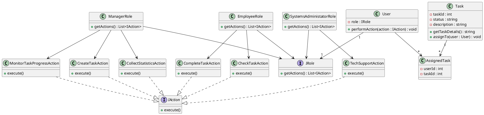

```plantuml
@startuml
' Интерфейс для проверки доступных действий для роли
interface IRole {
    +getActions() : List<IAction>
}

' Конкретные роли
class ManagerRole {
    +getActions() : List<IAction>
}
class EmployeeRole {
    +getActions() : List<IAction>
}
class SystemsAdministatorRole {
    +getActions() : List<IAction>
}
' Конкретные роли реализуют интерфейс IRole
ManagerRole --> IRole
EmployeeRole --> IRole
SystemsAdministatorRole --> IRole

' Определение интерфейса для действий
interface IAction {
    +execute()
}

' Конкретные действия
class CreateTaskAction {
    +execute()
}
class CollectStatisticsAction {
    +execute()
}
class TechSupportAction {
    +execute()
}
class CheckTaskAction {
    +execute()
}
class CompleteTaskAction {
    +execute()
}
class MonitorTaskProgressAction {
    +execute()
}

' Действия реализуют интерфейс IAction
CreateTaskAction ..|> IAction
CollectStatisticsAction ..|> IAction
TechSupportAction ..|> IAction
CheckTaskAction ..|> IAction
CompleteTaskAction ..|> IAction
MonitorTaskProgressAction ..|> IAction

' Пользователь
class User {
    -role : IRole
    +performAction(action : IAction) : void
}

' Задача
class Task {
    -taskId : int
    -status : string
    -description : string
    +getTaskDetails() : string
    +assignTo(user : User) : void
}

' Промежуточная таблица для связи пользователя и задачи
class AssignedTask {
    -userId : int
    -taskId : int
}

' Связь пользователя с ролью
User "1" --> "1" IRole
User --> "*" AssignedTask

' Связь задачи с промежуточной таблицей
Task "1" --> "*" AssignedTask

' Пример связи ролей с действиями через интерфейс
ManagerRole --> CreateTaskAction
ManagerRole --> CollectStatisticsAction
ManagerRole --> MonitorTaskProgressAction

EmployeeRole --> CheckTaskAction
EmployeeRole --> CompleteTaskAction

SystemsAdministatorRole --> TechSupportAction
@enduml
```
